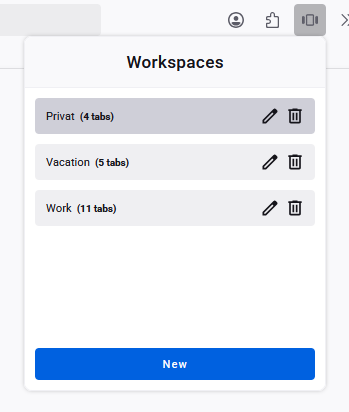
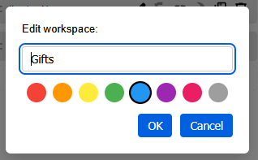
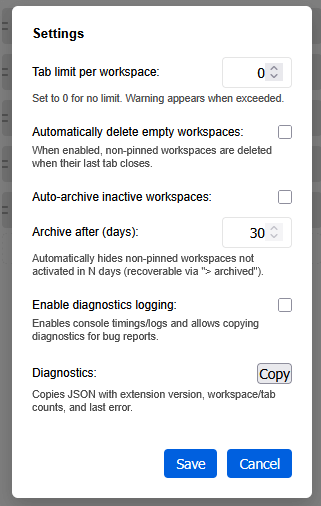
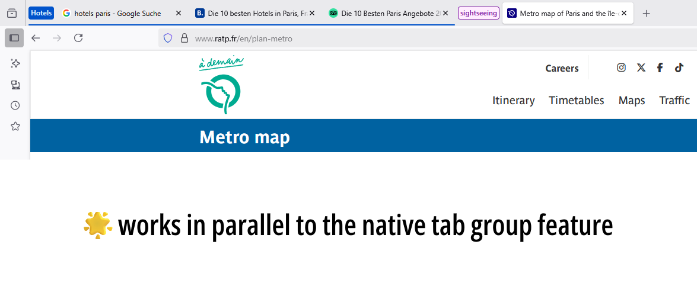
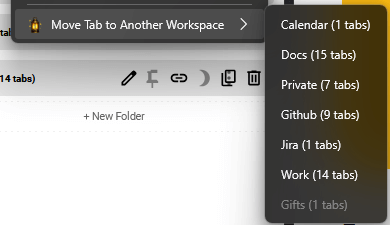

# Foxden

**Finally, a cozy den for all your tabs!**

Foxden is a workspace manager for Firefox that lets you organize your tabs into separate workspaces. Think of it like having multiple desks, each with its own set of papers — switch between them instantly without losing your place!

---

## Why Foxden?

Ever find yourself drowning in 50+ tabs? We've been there. Foxden gives your tabs a proper home:

- **Create workspaces** — Group tabs by project, topic, or mood (yes, there's a "cat videos" workspace calling your name)
- **Switch instantly** — Jump between workspaces with a click. Inactive tabs hide away, keeping your tab bar zen
- **Find anything** — Quick search across ALL your tabs and workspaces. No more "where did I put that?"
- **Stay organized** — Color-code workspaces, pin your favorites, even create folders!
- **Keyboard ninja?** — Full keyboard shortcuts for the power users among us

---

## See It In Action

|  |  |  |
|:---:|:---:|:---:|
| Create and manage workspaces | Name your workspaces | Adapts to your theme |

|  |  |
|:---:|:---:|
| Tab groups within workspaces | Move tabs with right-click |

---

## Get Started

### Quick Install

1. Grab [`Foxden-x.x.x.xpi`](https://github.com/visorcraft/Foxden/releases) from the releases page
2. In Firefox, head to `about:addons`
3. Click the gear icon → **"Install Add-on From File..."**
4. Select the downloaded file and you're in!

**Requirements:** Firefox 147 or newer

---

## Handy Shortcuts

| Shortcut | What it does |
|----------|-------------|
| `Alt+W` | Open Foxden popup |
| `Alt+Shift+N` | Create new workspace |
| `Ctrl+Alt+→` / `←` | Next/previous workspace |
| `Alt+1..9` | Jump to workspace by position |
| `Alt+P` | Quick switcher |
| `Alt+M` | Move current tab to another workspace |

---

## Learn More

Want the full scoop? Check out our docs:

- **[All Features](docs/FEATURES.md)** — The complete feature rundown
- **[Installation Options](docs/INSTALLATION.md)** — More ways to install
- **[Building from Source](docs/BUILDING.md)** — For the DIY crowd
- **[Security & Privacy](docs/SECURITY.md)** — What permissions we use and why
- **[Mozilla Signing](docs/SIGNING.md)** — Sign your own build

---

## Credits

Foxden is built on the shoulders of giants! Based on [fm-sys/firefox-workspaces](https://addons.mozilla.org/de/firefox/addon/firefox-workspaces/), which was originally based on [workspace-manager](https://addons.mozilla.org/firefox/addon/workspace-manager/).

---

## License

Mozilla Public License Version 2.0 — see [LICENSE.txt](LICENSE.txt)

---

*Happy tab wrangling!* 🦊
