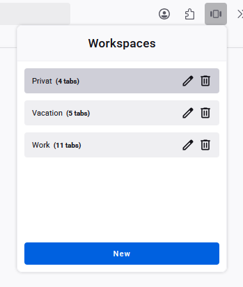
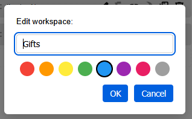
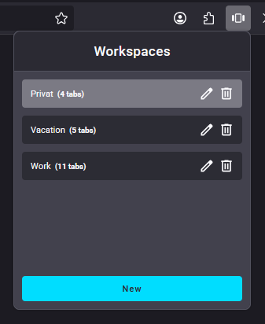
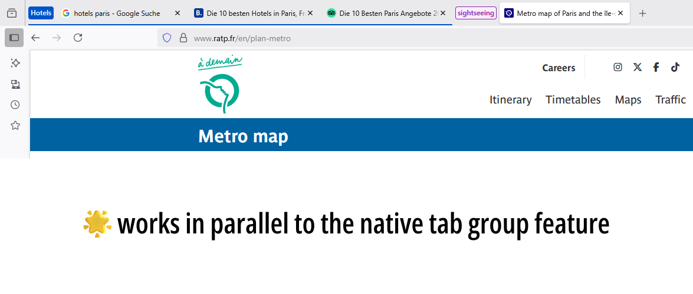
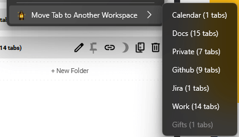

  

  <b>Finally, a cozy den for all your tabs!</b>
   
  Foxden is a workspace manager for Firefox that lets you organize your tabs into separate workspaces. Think of it like having multiple desks, each with its own set of papers — switch between them instantly without losing your place!
   
  Firefox · workspace manager · MPL-2.0

  
  
  
  

---

## Why Foxden?

Ever find yourself drowning in 50+ tabs? We've been there. Foxden gives your tabs a proper home:

- **Create workspaces** — Group tabs by project, topic, or mood (yes, there's a "cat videos" workspace calling your name)
- **Switch instantly** — Jump between workspaces with a click. Inactive tabs hide away, keeping your tab bar zen
- **Find anything** — Quick search across ALL your tabs and workspaces. No more "where did I put that?"
- **Stay organized** — Color-code workspaces, pin your favorites, even create folders!
- **Keyboard ninja?** — Full keyboard shortcuts for the power users among us

---

## See it in action

|  |  |  |
|:---:|:---:|:---:|
| Your workspaces live in the sidebar — one click away from tab nirvana | Rename workspaces AND pick a color? It's like naming your pets, but productive | Settings for the control freaks (we say that with love) |

|  |  |
|:---:|:---:|
| Folder rules: let Foxden sort your tabs automatically. Work smarter, not harder | Right-click any tab → send it packing to another workspace. Bye, tab!

---

## Get started

### Install from Mozilla Add-ons (recommended)

**[Get Foxden on Firefox Add-ons](https://addons.mozilla.org/en-US/firefox/addon/foxden/)** — One click, auto-updates, the works.

### Manual install

Prefer to live on the edge? Grab the latest from [GitHub Releases](https://github.com/visorcraft/Foxden/releases):

1. Download `Foxden-x.x.x.xpi`
2. In Firefox, go to `about:addons`
3. Click the gear icon → **"Install Add-on From File..."**
4. Select the file and you're in!

**Requirements:** Firefox 147 or newer

---

## Handy shortcuts

| Shortcut | What it does |
|----------|-------------|
| `Alt+W` | Open Foxden popup |
| `Alt+Shift+N` | Create new workspace |
| `Ctrl+Alt+→` / `←` | Next/previous workspace |
| `Alt+1..9` | Jump to workspace by position |
| `Alt+P` | Quick switcher |
| `Alt+M` | Move current tab to another workspace |

---

## Learn more

Want the full scoop? Check out our docs:

- **[All Features](docs/FEATURES.md)** — The complete feature rundown
- **[Installation Options](docs/INSTALLATION.md)** — More ways to install
- **[Building from Source](docs/BUILDING.md)** — For the DIY crowd
- **[Security & Privacy](docs/SECURITY.md)** — What permissions we use and why
- **[Mozilla Signing](docs/SIGNING.md)** — Sign your own build

---

## Credits

Foxden is built on the shoulders of giants! Based on [fm-sys/firefox-workspaces](https://addons.mozilla.org/de/firefox/addon/firefox-workspaces/), which was originally based on [workspace-manager](https://addons.mozilla.org/firefox/addon/workspace-manager/).

---

## License

Licensed under the **Mozilla Public License 2.0** (`MPL-2.0`) — see [`LICENSE.txt`](LICENSE.txt) for the full text. Foxden is a derivative work; see [Credits](#credits) for upstream attribution.
